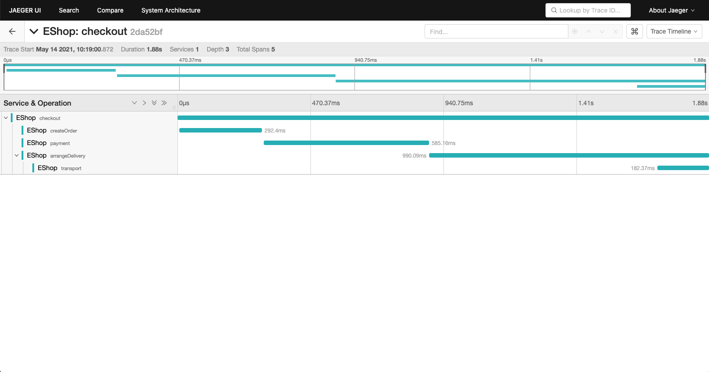

# EShop demo application

## How to build source code?

```bash
make
```

## Run and test the demo

```bash
./test.sh
```

## Check the generated trace and span at the Jaeger UI

Open URL ```http://127.0.0.1:16686/``` in the browser. You should be able to see the generated traces in the Jaeger UI.


